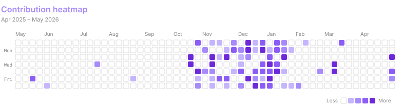
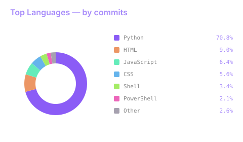

<!-- Header: animated wave banner via capsule-render -->

  

<!-- Bio: tongue-in-cheek developer description -->

  Developer of mostly-functional things and occasionally-shipped projects.
   
  Currently in the part of the project where things compile.

<!-- Animated typing intro via readme-typing-svg -->

  

<!-- Badges: focus and currently learning via shields.io -->

  
  

<!-- Tech stack icons via devicons CDN — languages in donut order, then tools -->

  
  &nbsp;
  
  &nbsp;
  
  &nbsp;
  
  &nbsp;
  
  &nbsp;
  
  &nbsp;
  
  &nbsp;
  

 

<!-- Contribution streak (purple accent, weekends included) via streak-stats.demolab.com -->

  

 

<!-- Contribution activity graph via github-readme-activity-graph -->

  

 

<!-- ==== Summary cards (github-profile-summary-cards.vercel.app) ==== -->

<table align="center">
  <tr>
    <td align="center">
      
      
       
      
      
       
      
    </td>
  </tr>
</table>

 

<!-- ==== Self-hosted widgets — heatmap + donut in one shared cell (SVGs committed in assets/) ==== -->

<!-- Both SVGs in a single cell to avoid zebra-striping -->
<table align="center">
  <tr>
    <td align="center">
      
       
      
    </td>
  </tr>
</table>
<!--
**particular-address/particular-address** is a ✨ _special_ ✨ repository because its `README.md` (this file) appears on your GitHub profile.

Here are some ideas that are getting started:

- 🔭 I’m currently working on ...
- 🌱 I’m currently learning ...
- 👯 I’m looking to collaborate on ...
- 🤔 I’m looking for help with ...
- 💬 Ask me about ...
-->
